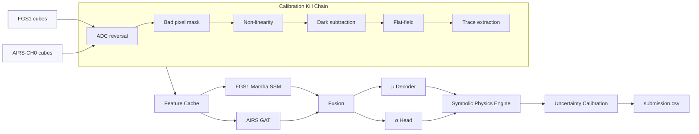

# SpectraMind V50
**Mission-Grade Neuro-Symbolic AI Pipeline for the NeurIPS 2025 Ariel Data Challenge**

---

## Mission Brief

SpectraMind V50 is a **physics-informed, neuro-symbolic AI system** built to win the [NeurIPS 2025 Ariel Data Challenge](https://www.cosmos.esa.int/web/ariel/).  
Its design goes beyond leaderboard chasing — the goal is to set a **reproducibility, explainability, and scientific fidelity standard** for exoplanet spectroscopy pipelines.

**Core Tenets**:
- **Win with physics-faithful μ/σ** predictions, robust to out-of-distribution (OOD) conditions.
- **Neuro-symbolic design** — deep sequence/graph encoders + differentiable physics constraints + ex-post logic audit.
- **FGS1-first strategy** — ~58× weight vs. any AIRS bin; architectural decisions hinge on this.
- **Reproducibility-first** — every artifact traceable to Git SHA, config hash, environment, and seed.
- **Operator-first explainability** — built-in SHAP × symbolic overlays, UMAP/t-SNE, FFT/smoothness, violation heatmaps.
- **Kaggle runtime discipline** — ≤ 9 h over ~1,100 planets (≤ 30 s/planet), enforced via telemetry.

---

## Scientific Context

Ariel observes transiting exoplanets from **0.5–7.8 μm**, extracting faint atmospheric signals from **instrument-noisy, astrophysically variable** data.  
The challenge simulates this, providing:

- **FGS1 (0.60–0.80 μm)** — broadband photometer; master transit shape & jitter tracking.
- **AIRS-CH0 (1.95–3.90 μm)** — infrared spectrometer; 282 narrow spectral bins.

**Key constraints**:
- **Gaussian Log-Likelihood (GLL)** — joint μ and σ accuracy, heavily penalizing miscalibration.
- **OOD test set** — new chemistries, temperatures, noise profiles.
- **Physical guardrails** — smoothness, non-negativity, molecular coherence, CH₄:H₂O:CO₂ ratios, quantile monotonicity.

---

## System Overview

### Dataflow



---

## Repository Structure

```
SpectraMind-V50/
├── spectramind.py              # Unified Typer CLI (train/predict/diagnose/calibrate/submit/etc.)
├── configs/                    # Hydra config hierarchy
│   ├── config_v50.yaml
│   ├── data/
│   ├── model/
│   └── train/
├── src/spectramind/
│   ├── data/                   # Calibration kill-chain, loaders
│   ├── models/                 # FGS1 Mamba, AIRS GAT, μ decoder, σ head
│   ├── symbolic/               # symbolic_loss.py, logic engine, profiles
│   ├── calibration/            # temp scaling, COREL
│   ├── inference/              # predict_v50.py
│   ├── training/               # train_v50.py (MAE→contrastive→supervised)
│   ├── diagnostics/            # SHAP, UMAP/t-SNE, FFT, HTML dashboard
│   ├── cli/                    # CLI wrappers, selftest, pipeline consistency checker
│   └── utils/                  # logging, hash/env/git capture
├── docs/                       # Operator guides, architecture, flight card
├── outputs/                    # Run artifacts (DVC-tracked)
├── dvc.yaml                    # DAG: calibrate→features→train→predict→diagnose
├── pyproject.toml / poetry.lock# Environment pinning (Poetry)
├── Dockerfile                  # CUDA runtime parity
├── .github/workflows/ci.yml    # CI/CD with reproducibility gates
├── v50_debug_log.md            # Human-readable audit log
└── events.jsonl                # Machine-readable event telemetry
```

---

## Quickstart — Local Mode

```bash
# Install dependencies
poetry install --no-root && poetry shell

# Verify GPU
nvidia-smi

# Run self-test
python -m spectramind selftest

# Train model
python -m spectramind train phase=mae
python -m spectramind train phase=contrastive
python -m spectramind train phase=supervised

# Calibrate & diagnose
python -m spectramind calibrate-temp
python -m spectramind calibrate-corel
python -m spectramind diagnose dashboard

# Predict & bundle
python -m spectramind predict --out-csv outputs/submission.csv
python -m spectramind submit bundle
```

---

## Quickstart — Kaggle Mode

```bash
# Predict for Kaggle runtime
python -m spectramind predict data=kaggle     --out-csv /kaggle/working/submission.csv
```

**Rules**:
- Always use `data=kaggle` config override.
- Keep total runtime ≤ 9 h.
- Precompute and cache whenever possible.

---

## Symbolic Physics Constraints

- **Smoothness** — penalize large 2nd derivative in μ.
- **Non-negativity** — μ ≥ 0 everywhere.
- **Molecular coherence** — linked bins for H₂O, CH₄, CO₂ must co-activate.
- **Seam continuity** — enforce continuity across detector seams.
- **CH₄:H₂O:CO₂ envelopes** — ratio constraints on integrated band areas.
- **Quantile monotonicity** — enforce q₁₀ ≤ q₅₀ ≤ q₉₀ for quantile heads.

---

## Reproducibility Stack

- **Git** — commit SHA in every run log.
- **Hydra** — full config snapshot + overrides in logs.
- **Poetry/Docker** — pinned Python + CUDA environment.
- **DVC** — datasets, calibration caches, checkpoints.
- **Logs** — `v50_debug_log.md` (human), `events.jsonl` (machine).

---

## Operator References
- **[Operator Flight Card (PDF)](docs/Operator_Flight_Card.pdf)** — laminated quick-reference for CLI ops.
- **`docs/ARCHITECTURE.md`** — deep dive into architecture & scientific rationale.
- **`docs/`** — calibration math, symbolic loss definitions, MLOps practices.
